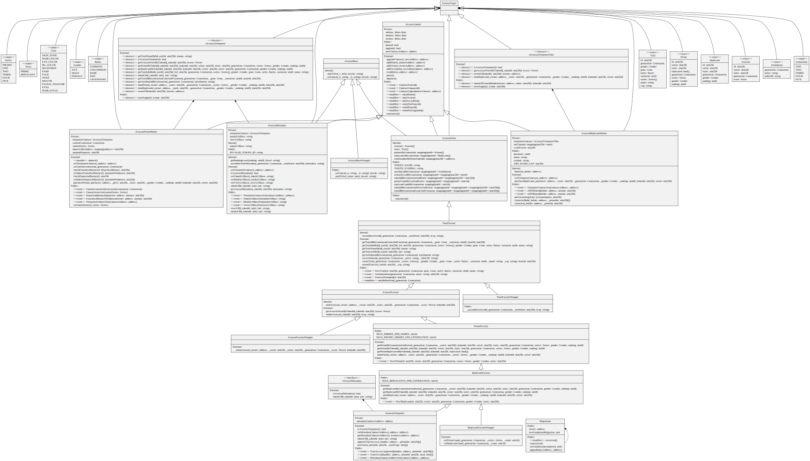

# Avastars Contract Architecture

The generated UML diagram below is quite difficult to navigate, so first, let's consider the contracts, their intended purpose, and their internal hierarchies. Keep in mind that Solidity contracts can inherit from multiple parent contracts.

Ultimately, there will be four deployed contracts:
* AvastarTeleporter
  - The main contract, maintains traits, mints Avastar Primes and Replicants, manages Prime replication flags and their handlers. The ERC-721 implementer.
* AvastarMetadata 
  - The upgradable metadata contract, bidirectionally tied to the AvastarTeleporter contract, generates standard and extended token metadata.
* AvastarPrimeMinter
  - The Avastar Prime minting proxy contract, unidirectionally tied to the AvastarTeleporter contract, manages user and franchise balances, and purchases of Primes. 
* AvastarPrimeMinter (coming soon)
  - The Avastar Replicant minting proxy contract, unidirectionally tied to the AvastarTeleporter contract, manages user and franchise balances, and purchases of Replicants. 

## AvastarTeleporter Contract Structure
```
* ERC721Full (Open Zepplin contract for implementing ERC-721 non-fungible tokens)
:  
:  * AccessControl (Role-based access, SafeMath, contract pause, unpause, upgrade)
:..:
:    * AvastarTypes (Common enums and structs used throughout the system)
:....:
:      * AvastarBase (Common utility functions used throughout the system)
:......:
:
* AvastarState (State variables for the AvastarTeleporter contract lineage)
:
* TraitFactory (Creation and management of Trait data)
:
* AvastarFactory (Minting and access functions for Avastars)
:
* PrimeFactory (Creation and access functions for Primes)
:
* ReplicantFactory (Creation and access functions for Replicants)
:
* AvastarTeleporter (Metadata access and management, trait reuse, and all inherited functionality)
```

## AvastarMetadata Contract Structure
```
* AccessControl (Role-based access, SafeMath, contract pause, unpause, upgrade)
:
:    * AvastarTypes (Common enums and structs used throughout the system)
:....:
:      * AvastarBase (Common utility functions used throughout the system)
:......:
:
* AvastarMetadata (Generation of standard and extended token metadata)
```

## AvastarPrimeMinter Contract Structure
```
* AccessControl (Role-based access, SafeMath, contract pause, unpause, upgrade)
:
:    * AvastarTypes (Common enums and structs used throughout the system)
:....:
:
* AvastarPrimeMinter (Management of deposits, balance transfers, purchases of Avastar Primes)
```

## AvastarReplicantMinter Contract Structure
```
* AccessControl (Role-based access, SafeMath, contract pause, unpause, upgrade)
:
:    * AvastarTypes (Common enums and structs used throughout the system)
:....:
:
* AvastarReplicantMinter (Management of deposits, balance transfers, purchases of Avastar Replicants)
```
## Full System UML Diagram

 [Download](https://dapp-wizards.github.io/Avastars-Contracts/media/AvastarsUML.svg)
 