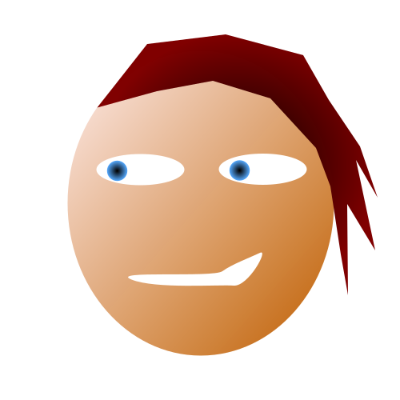

# Avastars SVG Layering

## Baseline size
The native size of an Avastar is ~~500x500~~ (1000x1000 now, but xamples below are built to a 500x500 size). This is an arbitrary size obviously,
since SVG scales, but we have to have a baseline so all the layers line up. 

## Trait layers
Each trait, such as hair, facial expression, hat, etc., will be chosen
at random and placed into an SVG 'sandwich' by the smart contract. Therefore
each layer should be considered a fragment, and *not* contain `<svg>` open
and close tags.

## Composition order
Human trait layers will be composed in the following order (from back to front):

* Background
* Skin Color
* Hair Color
* Eye Color
* Facial Expression
* Facial Markings
* Facial Hair
* Hair
* Hat
* Glasses
* Earrings
* Mouthpiece

## Colored layers
Certain traits (Hair Color, Eye Color, and Skin Color) will require the color
gradients be defined separately from the shapes that use them in order to be
layered properly. This will keep us from having to have separate
facial expression definitions for every combination of expression, eye color,
and skin color, or for every combination of hairstyle and hair color.



## COLOR DEFINITION EXAMPLES

### EYE COLOR
* In all cases, `id` must be `eye_color`
* Should not be wrapped in `<svg>` element, this is a fragment to be layered into the final avastar

```
    <!-- BLUE IRIS GRADIENT -->
    <radialGradient id="eye_color">
        <stop offset="0.025" stop-color="#000000"/>
        <stop offset="1" stop-color="#56aaff"/>
    </radialGradient>
```

### SKIN COLOR
* In all cases, `id` must be `skin_color`
* Should not be wrapped in `<svg>` element, this is a fragment to be layered into the final avastar


```
    <!-- TAN SKIN GRADIENT -->
    <linearGradient id="skin_color" x2="1" y2="1">
        <stop offset="0" stop-color="#FFEEEE"/>
        <stop offset="0.99927" stop-color="#bf5f00" stop-opacity="0.99609"/>
        <stop offset="1" stop-color="#001111"/>
    </linearGradient>
```

### HAIR COLOR
* In all cases, `id` must be `hair_color`
* Should not be wrapped in `<svg>` element, this is a fragment to be layered into the final avastar


```
    <!-- RED HAIR GRADIENT -->
    <radialGradient id="hair_color">
        <stop offset="0" stop-color="#none"/>
        <stop offset="1" stop-color="#7f0000" stop-opacity="0.99609"/>
    </radialGradient>

```

## LAYER EXAMPLES THAT REFERENCE COLOR DEFS

### HAIR LAYER
* In all cases, `id` must be `hair` and hair-colored paths should be filled with `url(#hair_color)`
* Should not be wrapped in `<svg>` element, this is a fragment to be layered into the final avastar


```
    <!-- HAIR LAYER -->
    <g id="hair">
        <path d="m121.5,134.5l62.5,-79.5l98,-12l97,26l32,56l39,58l22,64l-27,-47l24,113l-35,-58l1,114l-9,-51l-13,-85l-18,-48l-57,-62l-72,-22l-70,13c-24.83333,6.83333 -49.66667,13.66667 -74.5,20.5z"
              fill="url(#hair_color)"/>
    </g>
```

### FACIAL EXPRESSION LAYER
* In all cases, `id` must be `facial_expression`
* Individual subcomponents do not need an `id`
* Uses eye color and skin color definitions as well as local fill colors for eye whites and mouth
* Should not be wrapped in `<svg>` element, this is a fragment to be layered into the final avastar

```
    <!-- SIDEWAYS FACIAL EXPRESSION LAYER  -->
    <g id="facial_expression">

        <!-- SKIN -->
        <ellipse fill="url(#skin_color)"
                 cx="250.99999" cy="254.00001"
                 rx="166.5" ry="190.5"/>

        <!-- EYE WHITES -->
        <ellipse fill="#ffffff"
                 cx="175.5" cy="212"
                 rx="55" ry="19.5"/>

        <ellipse fill="#ffffff"
                 cx="328.5" cy="211.5"
                 rx="55" ry="19.5"/>

        <!-- EYE IRISES -->
        <circle fill="url(#eye_color)"
                cx="146.5" cy="213.5"
                r="12.72792"/>

        <circle fill="url(#eye_color)"
                cx="299.5" cy="213"r="12.72792"
                r="12.72792"/>

        <!-- MOUTH SMIRK -->
        <path d="m164.5,349.5c-30,-12 102,-2 113.5,-10.5c11.5,-8.5 35.5,-17.5 47,-23c11.5,-5.5 -14.5,42.5 -33,41c-18.5,-1.5 -97.5,4.5 -127.5,-7.5z"
              fill="#ffffff"/>

    </g>
```

## COMBINED RESULT

```
<svg width="500" height="500"
     xmlns="http://www.w3.org/2000/svg">

    <!-- EYE COLOR GRADIENT -->
    <radialGradient id="eye_color">
        <stop offset="0.025" stop-color="#000000"/>
        <stop offset="1" stop-color="#56aaff"/>
    </radialGradient>

    <!-- SKIN COLOR GRADIENT -->
    <linearGradient id="skin_color" x2="1" y2="1">
        <stop offset="0" stop-color="#FFEEEE"/>
        <stop offset="0.99927" stop-color="#bf5f00" stop-opacity="0.99609"/>
        <stop offset="1" stop-color="#001111"/>
    </linearGradient>

    <!-- HAIR COLOR GRADIENT -->
    <radialGradient id="hair_color">
        <stop offset="0" stop-color="#none"/>
        <stop offset="1" stop-color="#7f0000" stop-opacity="0.99609"/>
    </radialGradient>

    <!-- SIDEWAYS FACIAL EXPRESSION -->
    <g id="facial_expression">

        <!-- SKIN -->
        <ellipse fill="url(#skin_color)"
                 cx="250.99999" cy="254.00001"
                 rx="166.5" ry="190.5"/>

        <!-- EYE WHITES -->
        <ellipse fill="#ffffff"
                 cx="175.5" cy="212"
                 rx="55" ry="19.5"/>

        <ellipse fill="#ffffff"
                 cx="328.5" cy="211.5"
                 rx="55" ry="19.5"/>

        <!-- EYE IRISES -->
        <circle fill="url(#eye_color)"
                cx="146.5" cy="213.5"
                r="12.72792"/>

        <circle fill="url(#eye_color)"
                cx="299.5" cy="213"r="12.72792"
                r="12.72792"/>

        <!-- MOUTH SMIRK -->
        <path d="m164.5,349.5c-30,-12 102,-2 113.5,-10.5c11.5,-8.5 35.5,-17.5 47,-23c11.5,-5.5 -14.5,42.5 -33,41c-18.5,-1.5 -97.5,4.5 -127.5,-7.5z"
              fill="#ffffff"/>

    </g>

    <!-- HAIR -->
    <g id="hair">
        <path d="m121.5,134.5l62.5,-79.5l98,-12l97,26l32,56l39,58l22,64l-27,-47l24,113l-35,-58l1,114l-9,-51l-13,-85l-18,-48l-57,-62l-72,-22l-70,13c-24.83333,6.83333 -49.66667,13.66667 -74.5,20.5z"
              fill="url(#hair_color)"/>
    </g>

</svg>
```
